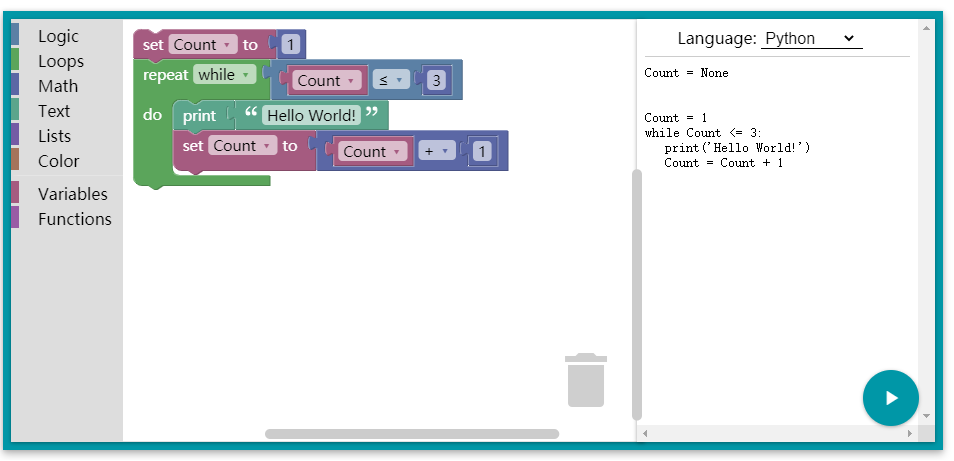
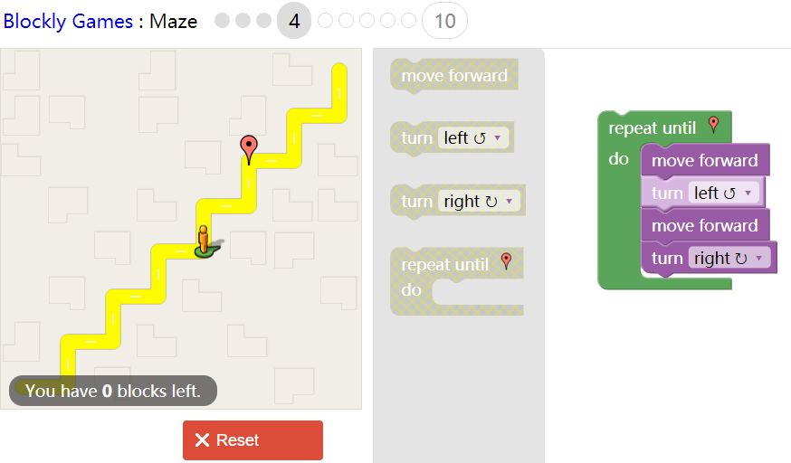

[google: blockly在线体验地址](https://developers.google.com/blockly) *需要VPN才可访问*

[blockly游戏地址](https://blockly.games/) 

# 简介

积木式编程, 同时能够将**积木转化为代码**, 但**不能**将代码转化为积木

支持 **Python JavaScript** PHP Lua Dart

**有一些基于Blockly的游戏** 比较有意思, 可以考虑作为第一节课的内容 [blockly游戏地址](https://blockly.games/) 

如: 走迷宫:

