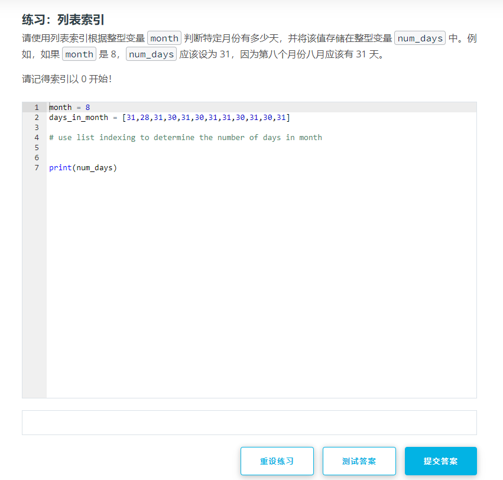

# Udacity CS101

地址: [Udacity: CS101](https://classroom.udacity.com/courses/ud1110)

## 简介

标准的慕课模式, 每个视频都很短 几分钟, 几个视频穿插一个练习, 有选择题有编程练习题.

编程环境就是标准的jupyter notebook, 这种教学模式在各类python网课中很常见

课程所用的编程环境**不能为我所用**, 但是直接使用jupyter是同样的效果

## 编程环境

非常标准的jupyter模式, markdown语法的文字介绍 + 预制模板的代码块

# 内容

基础的python内容 + 最终目标: 完成一个维基百科爬虫