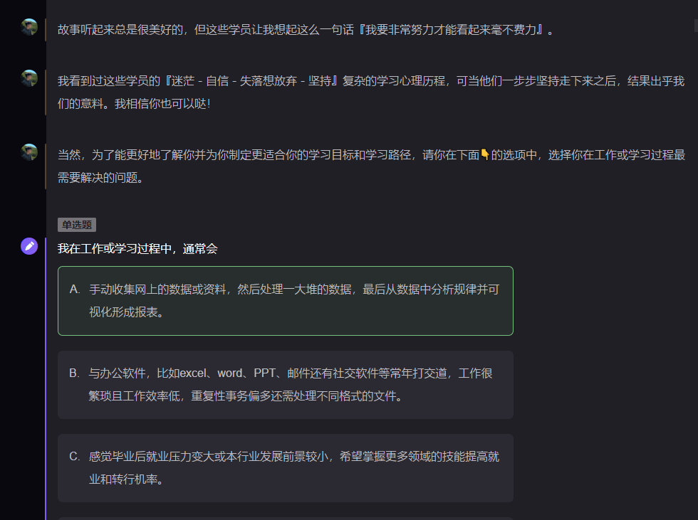
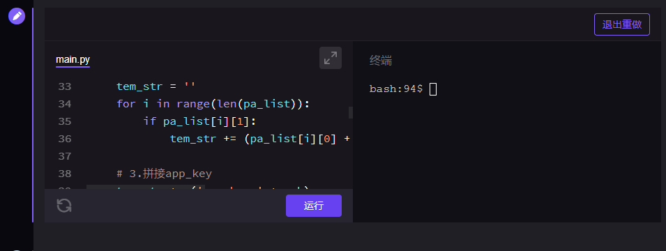
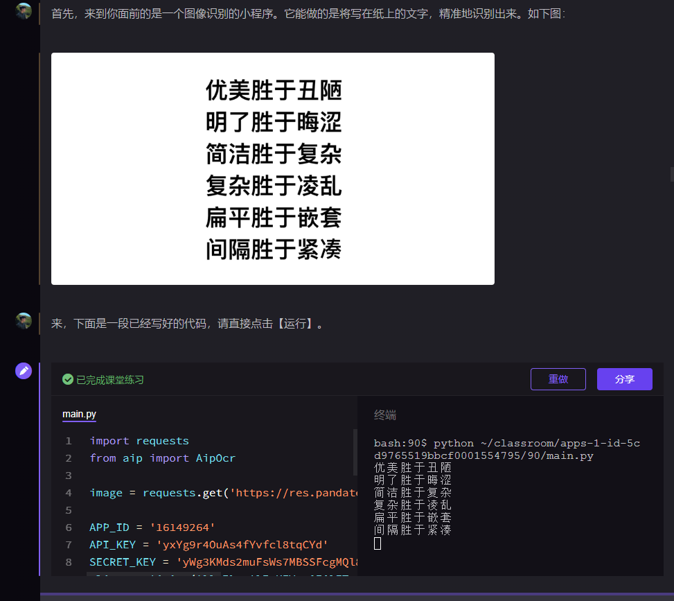
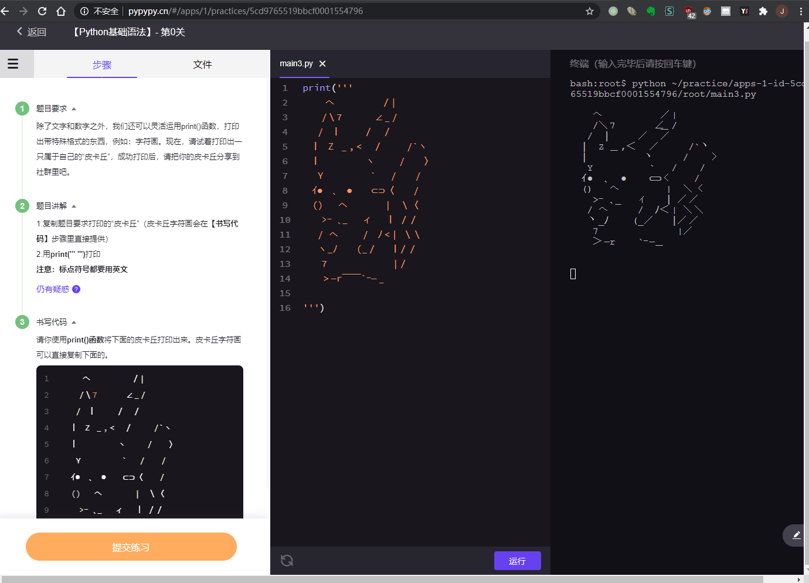

# 风变编程

[地址](https://www.pypypy.cn/)

## 简介

面向入门Python的大学生,职场人士. 当前有**基础语法**和**爬虫** 两个课程, 未来会开 自动化办公 GIT 数据分析 人工智能应用.

**学习环境**比较**类似jupyter** ,提供了一个像是微信聊天一样的界面, 这个界面中能够进行讲解, 问答, 编程实习(都是程序化的, 没有真人老师)

**编程练习环境**非常**类似CS50**的编程环境

## 学习环境

学习环境中有虚拟老师的讲解, 有问答环节:

在学习环境中可以内嵌这样小的编程练习模块, 左侧是代码, 右侧是在线的虚拟机运行环境, 点击`运行`就在右侧运行

## 编程环境

左侧是题目介绍, 中间是代码编写窗口, 右侧是在线运行环境, 有自动检测结果正确性的功能

比较好用, 但是**不能为我所用**, 我们不能自定义题目, 非付费学员也不能使用

## some other things

本地保存了一部分课程内容 点击查看: [风变编程.html](fengbian.assets\风变编程.html) 

