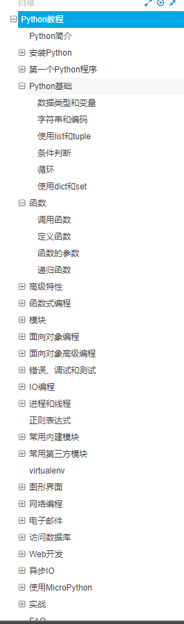
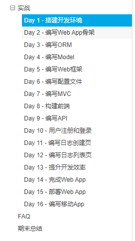

# 廖雪峰的python教程

**网址:**[廖雪峰的python教程](https://www.liaoxuefeng.com/wiki/1016959663602400)

## 简介

内容非常全面, 有非常多代码实例可参考

**没有特定的编程环境** 参考代码全部托管至github, 可以自由下载, 但没有运行环境

## 内容

非常非常全面, 但比较枯燥无聊...

目录:

有一些[实战案例](https://www.liaoxuefeng.com/wiki/1016959663602400/1018138223191520), 包含讲解和完整代码:

